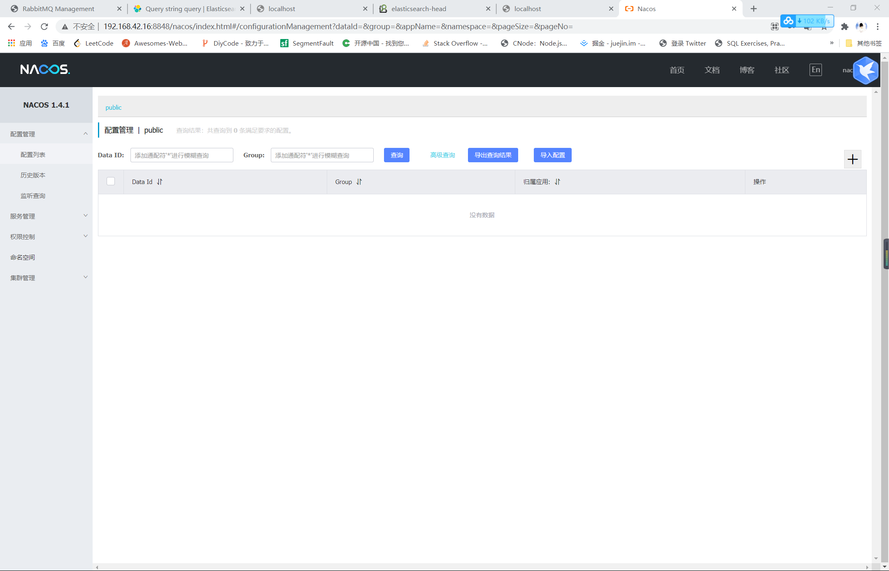
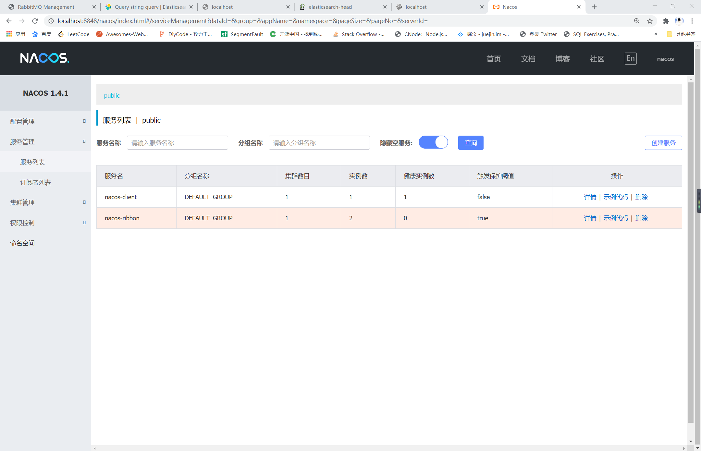
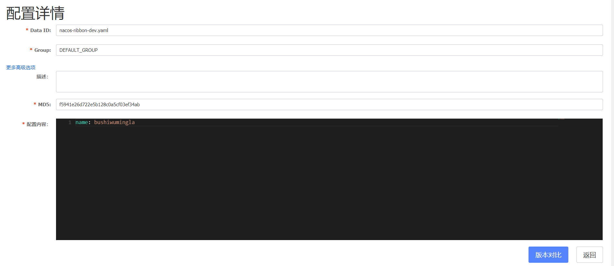

# Spring Cloud Alibaba Nacos 注册中心
## 简介
```text
    Spring Cloud Aliaba Nacos 是阿里巴巴推出的注册中心兼配置中心。Nacos 提供了一组简单易用的特性集，帮助您快速实现动态服务发现、服务配置、
服务元数据及流量管理。

Nacos特性：
    ①服务发现和服务健康监测：支持基于DNS和基于RPC的服务发现，支持对服务的实时的健康检查，阻止向不健康的主机或服务实例发送请求；
    ②动态配置服务：动态配置服务可以让您以中心化、外部化和动态化的方式管理所有环境的应用配置和服务配置；
    ③动态 DNS 服务：动态 DNS 服务支持权重路由，让您更容易地实现中间层负载均衡、更灵活的路由策略、流量控制以及数据中心内网的简单DNS解析服务；
    ④服务及其元数据管理：支持从微服务平台建设的视角管理数据中心的所有服务及元数据。
```
## 安装运行Nacos
```text
    官网下载Nacos: https://github.com/alibaba/nacos/releases
    
    解压文件，并且进入主文件夹，执行命令: mvn -Prelease-nacos -Dmaven.test.skip=true clean install -U

    进入nacos-1.4.1\distribution\target\nacos-server-1.4.1\nacos\bin目录: 执行md或者sh执行脚本
    注意一: 运行脚本需要配置号java环境JAVA_HOME。
    注意二: 1.2.0以后的坂本和1.4.1版本有点区别，执行脚本中1.2.0默认为单机模式，1.4.1默认为集群模式，所以1.4.1启动时会报错，需要注意。
            解决办法：
                修改1.4.1的可执行脚本
                set MODE="cluster"  改为  set MODE="standalone"

    运行成功后访问: http://192.168.42.16:8848/nacos  用户名和密码都是nacos。
```

## 创建工程模块 nacos 
```xml
    <dependencies>
        <!--nacos注册发现-->
        <dependency>
            <groupId>com.alibaba.cloud</groupId>
            <artifactId>spring-cloud-alibaba-nacos-discovery</artifactId>
        </dependency>
        <dependency>
            <groupId>org.springframework.boot</groupId>
            <artifactId>spring-boot-starter-web</artifactId>
        </dependency>
    </dependencies>
```
```yml
spring:
  application:
    name: nacos-client
  cloud:
    nacos:
      discovery:
        server-addr: 192.168.42.16:8848
server:
  port: 8081
```

## 使用Nacos作为配置中心
```xml
        <dependency>
            <groupId>com.alibaba.cloud</groupId>
            <artifactId>spring-cloud-alibaba-nacos-config</artifactId>
        </dependency>
```
```text
    在springcloud-nacos与springcloud-nacos-ribbon中配合演示。
```
### 新建bootstrap.yml作为springboot启动的主配置
```yaml
server:
  port: 9000
spring:
  application:
    name: nacos-ribbon
  cloud:
    nacos:
      discovery:
        server-addr: localhost:8848
      config:
        server-addr: localhost:8848
        file-extension: yaml #获取的yaml格式的配置
  profiles:
    active: dev
```
### 在nacos中添加配置
```text
    新建配置文件的格式为：${spring.application.name}-${spring.profiles.active}.${spring.cloud.nacos.config.file-extension}
```

### 发布后控制台
```text
2021-03-06 21:59:46.029  INFO 14752 --- [-localhost_8848] c.a.n.client.config.impl.ClientWorker    : [fixed-localhost_8848] [polling-resp] config changed. dataId=nacos-ribbon-dev.yaml, group=DEFAULT_GROUP
2021-03-06 21:59:46.037  INFO 14752 --- [-localhost_8848] c.a.n.client.config.impl.ClientWorker    : [fixed-localhost_8848] [data-received] dataId=nacos-ribbon-dev.yaml, group=DEFAULT_GROUP, tenant=null, md5=cb959ac60dad3f7d0f3401db74b839bb, content=name: hahahahahahahaahhahah
2021-03-06 21:59:46.038  INFO 14752 --- [-localhost_8848] c.a.nacos.client.config.impl.CacheData   : [fixed-localhost_8848] [notify-context] dataId=nacos-ribbon-dev.yaml, group=DEFAULT_GROUP, md5=cb959ac60dad3f7d0f3401db74b839bb
2021-03-06 21:59:46.671  WARN 14752 --- [-localhost_8848] c.a.c.n.c.NacosPropertySourceBuilder     : Ignore the empty nacos configuration and get it based on dataId[nacos-ribbon] & group[DEFAULT_GROUP]
2021-03-06 21:59:46.671  WARN 14752 --- [-localhost_8848] c.a.c.n.c.NacosPropertySourceBuilder     : Ignore the empty nacos configuration and get it based on dataId[nacos-ribbon.yaml] & group[DEFAULT_GROUP]
2021-03-06 21:59:46.671  INFO 14752 --- [-localhost_8848] b.c.PropertySourceBootstrapConfiguration : Located property source: [BootstrapPropertySource {name='bootstrapProperties-nacos-ribbon-dev.yaml,DEFAULT_GROUP'}, BootstrapPropertySource {name='bootstrapProperties-nacos-ribbon.yaml,DEFAULT_GROUP'}, BootstrapPropertySource {name='bootstrapProperties-nacos-ribbon,DEFAULT_GROUP'}]
2021-03-06 21:59:46.681  INFO 14752 --- [-localhost_8848] o.s.boot.SpringApplication               : The following profiles are active: dev
2021-03-06 21:59:46.681  INFO 14752 --- [-localhost_8848] o.s.boot.SpringApplication               : Started application in 0.646 seconds (JVM running for 531.4)
2021-03-06 21:59:46.701  INFO 14752 --- [-localhost_8848] o.s.c.e.event.RefreshEventListener       : Refresh keys changed: [name]
2021-03-06 21:59:46.701  INFO 14752 --- [-localhost_8848] c.a.nacos.client.config.impl.CacheData   : [fixed-localhost_8848] [notify-ok] dataId=nacos-ribbon-dev.yaml, group=DEFAULT_GROUP, md5=cb959ac60dad3f7d0f3401db74b839bb, listener=com.alibaba.cloud.nacos.refresh.NacosContextRefresher$1@69589798 
2021-03-06 21:59:46.701  INFO 14752 --- [-localhost_8848] c.a.nacos.client.config.impl.CacheData   : [fixed-localhost_8848] [notify-listener] time cost=663ms in ClientWorker, dataId=nacos-ribbon-dev.yaml, group=DEFAULT_GROUP, md5=cb959ac60dad3f7d0f3401db74b839bb, listener=com.alibaba.cloud.nacos.refresh.NacosContextRefresher$1@69589798 
```