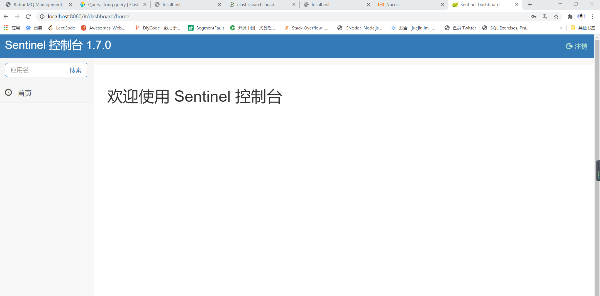

# SpringCloud Alibaba : Sentinel 熔断与限流
## 简介
```text
    具有熔断与限流等一系列服务保护功能。
```
## 安装 Sentinel 控制台
```text
    下载: https://github.com/alibaba/Sentinel/releases
    运行: java -jar sentinel-dashboard-1.6.3.jar
    登录: 用户名/密码    sentinel/sentinel
```

## 创建一个sentinel的工程
### 依赖
```xml
    <properties>
        <java.version>1.8</java.version>
        <alibaba-cloud.version>2.2.0.RELEASE</alibaba-cloud.version>
        <spring-cloud.verison>Hoxton.SR6</spring-cloud.verison>
    </properties>

    <dependencyManagement>
        <dependencies>
            <dependency>
                <groupId>com.alibaba.cloud</groupId>
                <artifactId>spring-cloud-alibaba-dependencies</artifactId>
                <version>${alibaba-cloud.version}</version>
                <scope>import</scope>
                <type>pom</type>
            </dependency>
            <dependency>
                <groupId>org.springframework.cloud</groupId>
                <artifactId>spring-cloud-dependencies</artifactId>
                <version>${spring-cloud.verison}</version>
                <scope>import</scope>
                <type>pom</type>
            </dependency>
        </dependencies>
    </dependencyManagement>

    <dependencies>
        <dependency>
            <groupId>com.alibaba.cloud</groupId>
            <artifactId>spring-cloud-alibaba-nacos-config</artifactId>
        </dependency>

        <dependency>
            <groupId>com.alibaba.cloud</groupId>
            <artifactId>spring-cloud-alibaba-nacos-discovery</artifactId>
        </dependency>
        <!--sentinel-->
        <dependency>
            <groupId>com.alibaba.cloud</groupId>
            <artifactId>spring-cloud-starter-alibaba-sentinel</artifactId>
        </dependency>
    </dependencies>
```
### 配置
```yaml

```